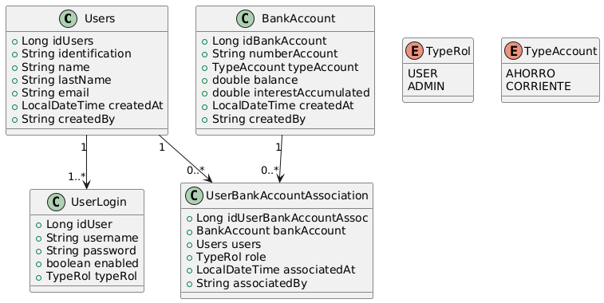

# SofBank Application

## Descripción del Proyecto
SofBank es una aplicación de gestión bancaria diseñada para manejar usuarios, cuentas bancarias y asociaciones entre ellos. La aplicación permite realizar operaciones CRUD sobre las entidades y asegura un manejo robusto de excepciones y seguridad.

## Características
- **Usuarios**: Gestión de creación, actualización, eliminación y búsqueda de usuarios.
- **Cuentas Bancarias**: Gestión de cuentas bancarias con diferentes tipos de cuentas.
- **Asociaciones**: Asociación dinámica entre usuarios y cuentas bancarias con roles específicos.
- **Seguridad**: Implementación de `UserDetailsService` para manejo de autenticación.
- **Pruebas**: Cobertura de pruebas unitarias y de integración para garantizar la funcionalidad.

---

## Estructura del Proyecto

El proyecto sigue una estructura bien definida para mantener una separación clara de responsabilidades:

## Diagrama de Clases


### Entidades Principales

1. **Users**: Maneja la información de los usuarios.
2. **BankAccount**: Representa una cuenta bancaria con su tipo y balance.
3. **UserBankAccountAssociation**: Define la asociación entre usuarios y cuentas bancarias.
4. **UserLogin**: Gestiona la autenticación y autorización de usuarios.

### Servicios

1. **UsersServices**:
  - Métodos: `createUser`, `getUserByIdentification`, `updateUser`, `deleteUser`
2. **BankAccountService**:
  - Métodos: `createAccount`, `getAccountByNumber`, `updateBalance`, `deposit`, `withdraw`
3. **UserLoginService**:
  - Método: `loadUserByUsername`
4. **UserBankAccountAssocServices**:
  - Métodos: `createAssociation`, `getAssociation`, `updateAssociation`, `deleteAssociation`

### Repositorios
1. **UsersRepository**
2. **BankAccountRepository**
3. **UserBankAccountAssocRepository**
4. **UserLoginRepository**

### DTOs
1. **BankAccountDTO**: Transferencia de datos para cuentas bancarias.
2. **UserBankAccountAssociationDTO**: Transferencia de datos para asociaciones usuario-cuenta.
3. **UsersDTO**: Transferencia de datos de los Usuarios (Clientes).
4. **TransactionRequestDTO**: Transferencia de Datos claves y protegidos para transferencias.

### Excepciones Personalizadas
- `UsersNotFoundException`
- `AccountNotFoundException`
- `AssociationNotFoundException`

---

## Tecnologías Utilizadas
- **Java 17**
- **Spring Boot 3.0**
- **H2 Database** (Base de datos en memoria para pruebas)
- **JPA/Hibernate**
- **Mockito** (para pruebas unitarias)
- **Junit 5**
- **Spring Security (Autenticación y autorización)**
- **SLF4J/Logback (Logueo)**
- **Gradle**
- **Lombok**

---

## Rutas
- **`com.SofBank.bank.domains.aplicacion`**: Contiene la clase principal `Main`, que actúa como el punto de entrada del programa.
- **`com.SofBank.bank.domains.modelo`**: Contiene las clases que representan las entidades del negocio, como:
    - `CuentaBancaria`: Clase base para las cuentas bancarias.
    - `CuentaAhorro`: Subclase que implementa una cuenta de ahorro.
    - `CuentaCorriente`: Subclase que implementa una cuenta corriente.
    - `TipoCuenta`: Enum que define los tipos de cuentas disponibles.
- **`com.SofBank.bank.domains.Fabric`**: Contiene las clases relacionadas con el patrón **Factory**, incluyendo:
    - `CtaBancariaFactory`: Clase abstracta base para las fábricas de cuentas.
    - `CtaAhorroFactory`: Implementación de fábrica para cuentas de ahorro.
    - `CtaCorrienteFactory`: Implementación de fábrica para cuentas corrientes.
- **`com.SofBank.bank.domains.Strategy`**: Contiene las clases relacionadas con el patrón **Strategy**, como:
    - `CtaAhorroStrategy`: Estrategia para calcular intereses en cuentas de ahorro.
    - `CtaCorrienteStrategy`: Estrategia para calcular intereses en cuentas corrientes.
- **`com.SofBank.bank.infraestructure.logging`**: Contiene la clase relacionada con el patrón **Singleton**:
    - `TransactionLogger`: Clase responsable de registrar las transacciones realizadas en las cuentas.
- **`com.SofBank.bank.domains.Observer`** (si se implementa): Contendrá las clases necesarias para notificar cambios en las cuentas.

## Principios SOLID

El diseño del sistema respeta los principios SOLID:
1. **Responsabilidad única (SRP)**: Cada clase tiene una única responsabilidad.
2. **Abierto/Cerrado (OCP)**: Las clases están abiertas para la extensión pero cerradas para la modificación.
3. **Sustitución de Liskov (LSP)**: Las subclases pueden sustituir a sus superclases sin alterar el comportamiento esperado.
4. **Segregación de Interfaces (ISP)**: Las interfaces son específicas al cliente, evitando métodos innecesarios.
5. **Inversión de Dependencia (DIP)**: Las clases de alto nivel no dependen de las de bajo nivel, sino de abstracciones.

## Funcionalidades
Creación de cuentas bancarias: Usando el patrón Factory, se pueden crear diferentes tipos de cuentas bancarias.
Cálculo de intereses: Con el patrón Strategy, se calcula el interés según el tipo de cuenta.
Registro de transacciones: Gracias al patrón Singleton, todas las transacciones son registradas globalmente.
Extensibilidad: La estructura permite agregar nuevos tipos de cuentas y estrategias de cálculo fácilmente.

## Funcionalidades Principales

1. **Usuarios**:
- Registro de usuarios.
- Actualización de información del usuario.
- Asociación de roles.

2. **Cuentas Bancarias**:
- Creación de cuentas bancarias.
- Depósitos y retiros.
- Actualización del saldo.

3. **Asociaciones**:
- Crear asociaciones entre usuarios y cuentas.
- Actualizar y eliminar asociaciones.

4. **Autenticación y Autorización**:
- Login de usuarios con validación de credenciales.
- Asignación de roles y permisos.

## Pruebas

### Herramientas y Frameworks
- **JUnit 5**: para pruebas unitarias.
- **Mockito**: para simulación de dependencias.
- 
### Cobertura de Pruebas
- **UsersServiceTest**: Pruebas para la gestión de usuarios.
- **BankAccountServiceTest**: Validación de operaciones en cuentas bancarias.
- **UserBankAccountAssocServicesTest**: Pruebas de las asociaciones entre usuarios y cuentas.
- **UserLoginServiceTest**: Verificación del proceso de autenticación.

### Cómo Ejecutar las Pruebas
1. Desde IntelliJ IDEA o cualquier IDE compatible, navega a las clases de prueba dentro del directorio `/src/test/java`.
2. Ejecuta las pruebas haciendo clic derecho sobre el archivo de prueba y seleccionando **Run**.
3. También puedes usar Maven:
   ```bash
   mvn test
   ```

---

## Configuración del Entorno

1. **Base de Datos**
- H2 Database: Configurada como base de datos en memoria para pruebas.
- Archivo application.properties contiene la configuración.

2. **Seguridad**
- Spring Security: Configurado para manejar la autenticación.
- Contraseñas almacenadas usando BCrypt.

### Requisitos
- **Java 17**
- **Maven 3.8+**

### Instalación y Configuración
1. Clona el repositorio:
   ```bash
   git clone https://github.com/julianest/SofBankSpring.git
   ```
2. Accede al directorio del proyecto:
   ```bash
   cd sofbank
   ```
3. Construye el proyecto con Maven:
   ```bash
   mvn clean install
   ```
4. Ejecuta la aplicación:
   ```bash
   mvn spring-boot:run
   ```
5. Accede a la aplicación en tu navegador en `http://localhost:8080`.

---

## POSTMAN
Colecciones:
[SofkaBank.postman_collection.json](src/main/resources/SofkaBank.postman_collection.json)

## SWAGGER
- Revisar Documentacion de los controllers en el siguiente enlace:
 http://localhost:8080/swagger-ui/index.html

## TODO
- Mejorar la cobertura de pruebas unitarias.
- Implementar endpoints REST para interacción con las entidades.
- Agregar Licencia


## Autor
**Julian Steven Huerfano.**

---

## Contribuciones
Si deseas contribuir, por favor crea un fork del repositorio y envía un pull request con tus cambios.

---

## Licencia
Este proyecto está bajo la Licencia MIT. Puedes consultar el archivo LICENSE para más detalles.


